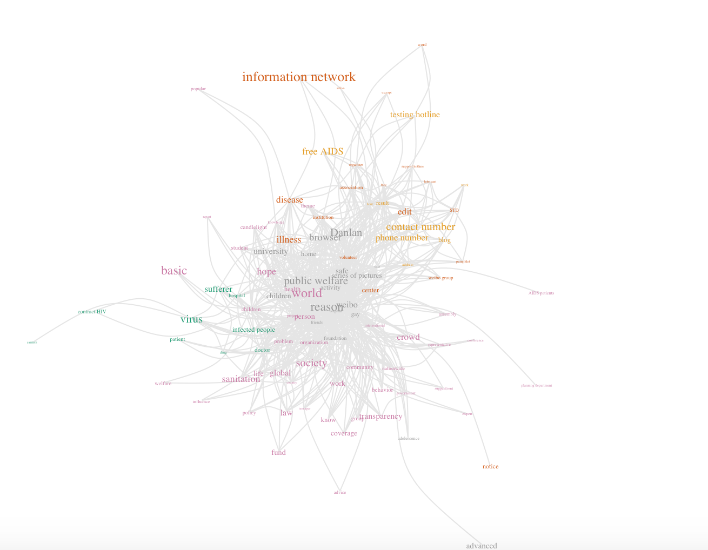

## NLP Toolkit for Social Science

## Overview
It is a natural language processing (NLP) toolkit for social science. The main functionalities include `text crawling`, `text tokenization`, `token filtering` and `token clustering`, which we hope could facilitate the research of computational social science. 

Further information please contact [Ziwei Liu](http://personal.ie.cuhk.edu.hk/~lz013/).
  
## Prerequisites
The code is written in `Python` and requires the following third party libraries:
* [Beautiful Soup](https://www.crummy.com/software/BeautifulSoup/bs4/doc/)
* [THULAC-Python](https://github.com/thunlp/THULAC-Python)
